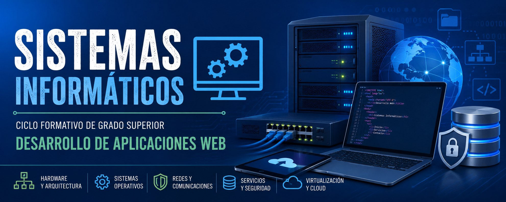

---
hide:
  - navigation
---

# Sistemas Informáticos

Apuntes del módulo profesional **Sistemas Informáticos** (código 0483), del ciclo formativo de grado superior **Técnico Superior en Desarrollo de Aplicaciones Web (DAW)**, impartido en la Comunitat Valenciana.

## Índice de unidades

- [UT1. Sistemas Informáticos. Hardware y Software](ut1.md)
- [UT2. Redes](ut2.md) Próximamente
- [UT3. Sistemas operativos: Instalación y primeros pasos](ut3.md) Próximamente
- [UT4. Sistemas operativos: Configuración y administración](ut4.md) Próximamente

## Resultados de aprendizaje

| RA | Descripción | Unidad(es) |
| --- | --- | --- |
| RA1 | Evalúa sistemas informáticos, identificando sus componentes y características. | UT1 |
| RA2 | Instala sistemas operativos planificando el proceso e interpretando documentación técnica. | UT3 |
| RA3 | Gestiona la información del sistema identificando estructuras de almacenamiento y aplicando medidas para asegurar la integridad de los datos. | UT4 |
| RA4 | Gestiona sistemas operativos utilizando comandos y herramientas gráficas evaluando las necesidades del sistema. | UT4 |
| RA5 | Interconecta sistemas en red configurando dispositivos y protocolos. | UT2 |
| RA6 | Opera sistemas en red gestionando sus recursos e identificando restricciones de seguridad. | UT2 |
| RA7 | Elabora documentación valorando y utilizando aplicaciones informáticas de propósito general. | UT1, UT2, UT3 (transversal) |

## Distribución horaria

El módulo se organiza en 4 unidades de trabajo, con un total de **140 horas en el centro educativo** y **26 horas de formación en la empresa**, a razón de **5 horas semanales**.

| Unidad de trabajo | Horas |
| --- | --- |
| UT1. Sistemas Informáticos. Hardware y Software | 25 |
| UT2. Redes | 35 |
| UT3. Sistemas operativos: Instalación y primeros pasos | 45 |
| UT4. Sistemas operativos: Configuración y administración | 35 |
| **Total en el centro** | **140** |
| Formación en la empresa | 26 |
