# UT1. Arquitectura y componentes de los sistemas informáticos

[:material-arrow-left: Volver al índice de todas las unidades](index.md)

!!! tip "Duración"
    25 horas

!!! abstract "Resultado de aprendizaje que se trabaja"
    **RA1.** Evalúa sistemas informáticos, identificando sus componentes y características.

    *Transversal:* **RA7** (parcial) — búsqueda y valoración de la fiabilidad de documentación técnica en Internet.

## 1.1. Arquitectura de un sistema informático

Un **sistema informático** es el conjunto de elementos hardware y software que trabajan de forma coordinada para procesar información: capturarla, almacenarla, tratarla y comunicar el resultado. Antes de estudiar cada componente por separado (secciones siguientes), conviene tener una visión de conjunto de cómo se organizan y se comunican entre sí.

**El modelo de von Neumann:** organiza conceptualmente un sistema informático en tres bloques funcionales —unidad de procesamiento, memoria y entrada/salida— conectados mediante un sistema de buses.

- **Unidad central de proceso (CPU)**: ejecuta las instrucciones (ver 1.4).
- **Memoria principal**: almacena, con el mismo formato y en la misma memoria, tanto los datos como las instrucciones de los programas en ejecución (el llamado **concepto de programa almacenado**).
- **Módulos de entrada/salida**: comunican el sistema con el exterior (periféricos, almacenamiento secundario, redes).

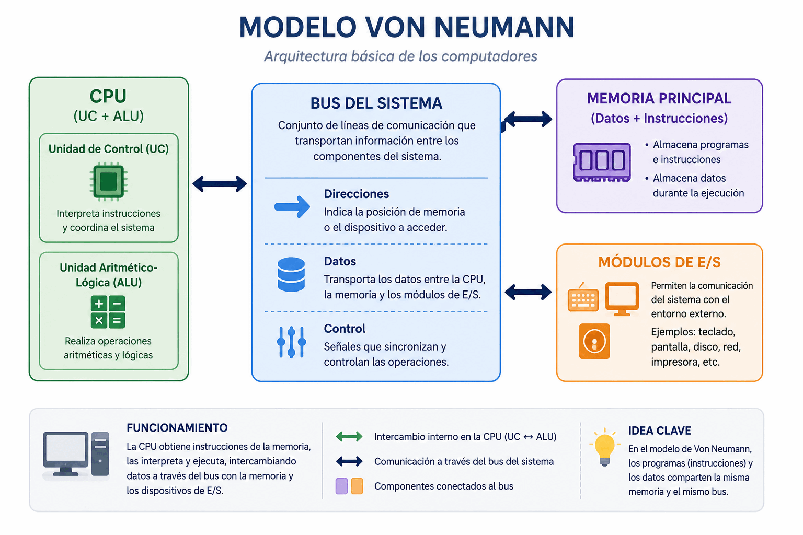

!!! note "Arquitectura Harvard"
    Algunos sistemas especializados (microcontroladores, DSP) usan memorias físicamente separadas para instrucciones y datos, lo que permite acceder a ambas a la vez y ganar velocidad. Es la **arquitectura Harvard**, alternativa al modelo von Neumann.

**El bus del sistema** es el conjunto de líneas físicas que permite la comunicación entre la CPU, la memoria y los módulos de E/S. Se compone de tres subconjuntos:

| Bus | Sentido | Función |
| --- | --- | --- |
| Bus de direcciones | Unidireccional (CPU → resto) | Indica la posición de memoria o el dispositivo de E/S al que se quiere acceder. Su anchura (nº de líneas) determina la cantidad máxima de memoria direccionable. |
| Bus de datos | Bidireccional | Transporta la información que se lee o escribe. Su anchura determina cuántos bits se transfieren en cada ciclo. |
| Bus de control | Bidireccional | Transporta señales de sincronización: lectura/escritura, interrupciones, señal de reloj, etc. |

!!! note "Idea clave"
    Este esquema general de bloques y buses es el que se concreta físicamente en la placa base (ver 1.3): el chipset y sus buses de expansión son, en la práctica, una implementación moderna de este mismo modelo.

???+ note "Referencia rápida: binario, octal y hexadecimal"
    Los ordenadores solo manejan dos estados (0/1), por lo que la información se representa internamente en **binario** (base 2). Como escribir números binarios largos es poco práctico, se usan dos notaciones que agrupan bits: el **octal** (base 8, agrupa de 3 en 3 bits) y, mucho más habitual hoy, el **hexadecimal** (base 16, agrupa de 4 en 4 bits, con las cifras 0-9 y A-F).

    | Decimal | Binario | Octal | Hexadecimal |
    | --- | --- | --- | --- |
    | 0 | 0000 | 0 | 0 |
    | 1 | 0001 | 1 | 1 |
    | 2 | 0010 | 2 | 2 |
    | 3 | 0011 | 3 | 3 |
    | 4 | 0100 | 4 | 4 |
    | 5 | 0101 | 5 | 5 |
    | 6 | 0110 | 6 | 6 |
    | 7 | 0111 | 7 | 7 |
    | 8 | 1000 | 10 | 8 |
    | 9 | 1001 | 11 | 9 |
    | 10 | 1010 | 12 | A |
    | 11 | 1011 | 13 | B |
    | 12 | 1100 | 14 | C |
    | 13 | 1101 | 15 | D |
    | 14 | 1110 | 16 | E |
    | 15 | 1111 | 17 | F |

    Se usan continuamente en este módulo, aunque no siempre se diga de forma explícita: los **permisos de Linux** se expresan en octal (`chmod 754`, ver UT3 — cada cifra agrupa exactamente los 3 bits rwx de propietario, grupo y otros), y las **direcciones MAC** y las **IPv6** (ver UT4) se escriben en hexadecimal, donde cada pareja de dígitos representa un byte completo. Y la propia anchura del bus de direcciones, mencionada más arriba, se mide en potencias de 2 precisamente porque cada línea que se añade duplica el número de posiciones representables en binario.

**Clasificación de los sistemas informáticos**

Según el **número de usuarios** que pueden trabajar simultáneamente sobre el mismo sistema:

- **Monousuario**: un único usuario utiliza todos los recursos del sistema en cada momento (un PC doméstico o de oficina habitual).
- **Multiusuario**: varios usuarios acceden y comparten simultáneamente los recursos del mismo sistema, normalmente a través de terminales o sesiones remotas (servidores, mainframes).

Según su **tamaño y potencia de cálculo**, de menor a mayor:

| Tipo | Ejemplo | Uso típico |
| --- | --- | --- |
| Sistema embebido | Microcontrolador de un electrodoméstico o un coche | Una función específica y dedicada |
| Dispositivo móvil | Smartphone, tablet | Uso personal, movilidad |
| Equipo de sobremesa/portátil | PC, portátil | Uso personal u ofimático |
| Estación de trabajo (workstation) | Equipo de diseño 3D, edición de vídeo | Tareas profesionales de alto rendimiento |
| Servidor | Servidor de ficheros, web o base de datos | Prestar servicio a otros equipos de la red |
| Mainframe | Sistema central de un banco o una administración | Procesar grandes volúmenes de transacciones críticas |
| Superordenador (HPC) | Clúster de cálculo científico | Cálculo masivo en paralelo |

## 1.2. Chasis, alimentación y refrigeración

**Chasis (caja):** recinto metálico o de plástico que alberga los componentes principales del ordenador. A la hora de elegirlo se valoran su estructura y distribución interna, la ventilación, las posibilidades de expansión (número de bahías para discos y unidades) y la estética.

**Formatos de chasis habituales**, de menor a mayor tamaño:

| Foto | Formato | Altura aprox. | Bahías | Placas que admite |
| --- | --- | --- | --- | --- |
| [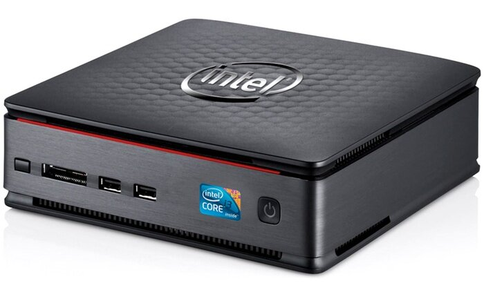{width=64}](img/ut1_chasis_mini.jpg) | Mini | — | Muy pocas | Formatos pequeños (Mini-ITX); puede llevar placa y fuente integradas (**barebone**) |
| [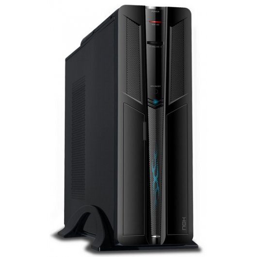{width=64}](img/ut1_chasis_slim.jpg) | Slim | — | 1-2 | Micro-ATX, Flex-ATX |
| [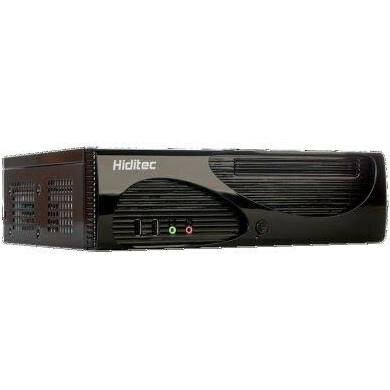{width=64}](img/ut1_chasis_sobremesa.jpg) | Sobremesa (desktop) | — | Variable | Cualquier formato; caja apaisada, cómoda para apoyar el monitor encima |
| [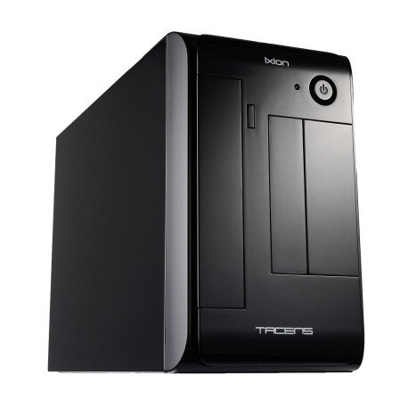{width=64}](img/ut1_chasis_microtorre.jpg) | Microtorre | 25-32 cm | 2-4 | Micro-ATX, Flex-ATX y formatos ajustados |
| [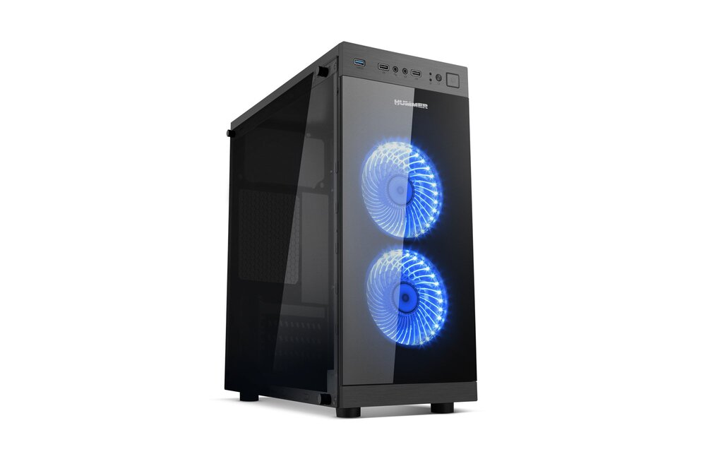{width=64}](img/ut1_chasis_minitorre.jpg) | Minitorre | 32-37 cm | 3-4 | Formatos que no requieren espacio ajustado |
| [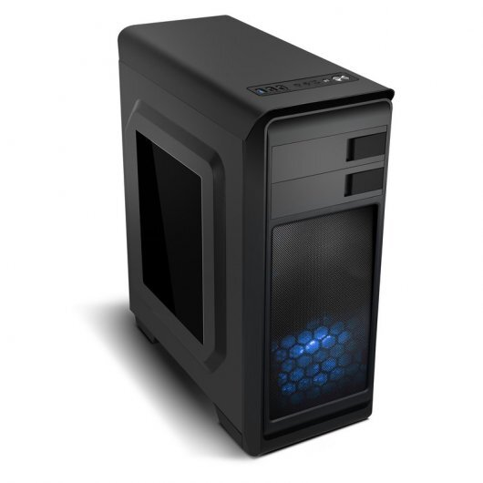{width=64}](img/ut1_chasis_semitorre.jpg) | Semitorre | 37-45 cm | Hasta 6 | Todos los formatos; es la más habitual |
| [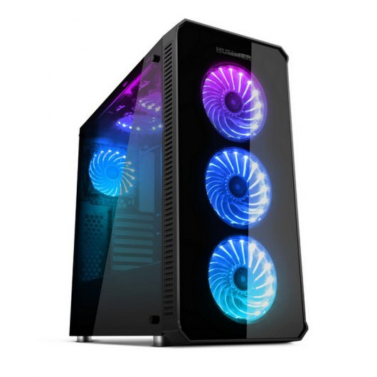{width=64}](img/ut1_chasis_torre.jpg) | Torre | 45-55 cm | 6 o más | Todos los formatos; buena ventilación |
| [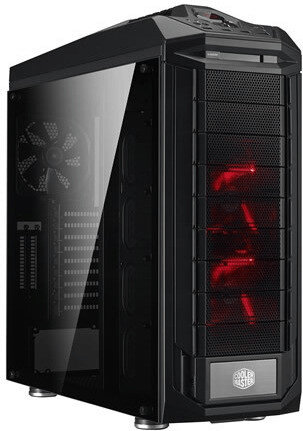{width=64}](img/ut1_chasis_gran_torre.jpg) | Gran torre | 55-72 cm | 8 o más | Todos los formatos; servidores de gama baja |
| [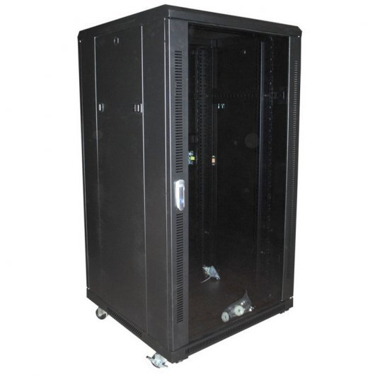{width=64}](img/ut1_chasis_rack.jpg) | Armario rack | — | Según U | Servidores montados en bastidor; excelente flujo de aire y cableado ordenado |

Toca o haz clic en cualquier miniatura para verla a tamaño completo. También puedes ver todas las fotografías juntas en el **[catálogo visual — Formatos de caja](catalogo-componentes.md#formatos-de-caja)**.

!!! note "Idea clave"
    El formato del chasis debe ser compatible con el formato de la placa base (ver 1.3) y con el tamaño de la fuente de alimentación; no son elecciones independientes.

**Fuente de alimentación (PSU):** transforma la corriente alterna de la red eléctrica (220V) en las distintas corrientes continuas que necesitan los componentes. Es un elemento clave para la estabilidad del sistema, las posibilidades de expansión (cuánta potencia puede entregar a componentes adicionales) y el consumo energético del equipo; las certificaciones como **Energy Star** indican una mayor eficiencia energética.

**Evolución de los modelos de fuente de alimentación:**

| Modelo | Situación | Características |
| --- | --- | --- |
| AT | En desuso | Alimentaba la placa mediante dos conectores de 6 contactos; interruptor de encendido externo por el que circulaba mucho voltaje (poco seguro) |
| ATX | Estándar muy extendido en equipos de sobremesa | Conector principal de 20/24 pines; proporciona líneas de +3,3 V, +5 V y +12 V, además de −12 V en el diseño tradicional; apagado y encendido gestionados por la placa base |
| SFX / SFX-L | Formatos reducidos | Dimensiones inferiores a ATX, para barebones y equipos de perfil bajo; el SFX-L es algo mayor que el SFX |

**Conector principal ATX (24 pines) — voltajes y colores habituales de los cables:**

| Color del cable | Voltaje / señal | Uso típico |
| --- | --- | --- |
| Naranja | +3,3 V | Algunos circuitos de la placa base y otros componentes |
| Rojo | +5V | Electrónica auxiliar |
| Amarillo | +12 V | Procesador, tarjeta gráfica, motores de discos y ventiladores |
| Negro | Tierra (GND) | Referencia común (0V) |
| Morado | +5V standby | Alimenta el circuito de encendido aunque el equipo esté "apagado" |
| Verde | PS_ON | Señal de encendido, activada por la placa base |
| Gris | Power Good | Confirma que los voltajes son estables antes de permitir el arranque |

!!! tip "Comprobación con multímetro"
    Antes de dar por averiada una fuente de alimentación, puede comprobarse con un multímetro que entrega los voltajes esperados en los pines del conector principal (fuente encendida y, si es necesario, con el cable verde puenteado a uno negro para forzar el encendido sin la placa base conectada).

**Sistemas de refrigeración:** mantener el equipo a una temperatura adecuada es fundamental para su rendimiento y su vida útil. Los componentes que más calor generan son el microprocesador, la tarjeta gráfica, el chipset de la placa base, la memoria RAM y el disco duro.

- **Refrigeración por aire**: ventiladores del chasis, disipadores metálicos y *coolers* (disipador + ventilador) sobre los componentes que más calientan. Es la solución más habitual, sencilla y económica.
- **Refrigeración líquida**: un líquido refrigerante circula por un circuito cerrado, absorbiendo el calor de los componentes (normalmente la CPU) y disipándolo en un radiador externo. Permite disipar más calor y con menos ruido que el aire, a cambio de mayor coste y complejidad de instalación.

## 1.3. Placas base y formatos

La **placa base** (motherboard) es el circuito impreso principal de un ordenador: interconecta el procesador, la memoria, el almacenamiento, los periféricos y las tarjetas de expansión a través de un conjunto de buses y controladores.

**Elementos principales de una placa base:**

- **Chipset**: conjunto de circuitos integrados que gestiona la comunicación entre CPU, memoria y periféricos. En placas modernas suele reducirse a un único chip, el **PCH** (Platform Controller Hub), que sustituye a los antiguos *northbridge* (gestión de memoria y gráfica) y *southbridge* (gestión de E/S).
- **Zócalo (socket)** del procesador: define qué modelos de CPU son compatibles físicamente. Según dónde se ubiquen los pines de contacto, existen tres tipos: **PGA** (*Pin Grid Array*, pines en el propio procesador), **LGA** (*Land Grid Array*, pines en la placa base; habitual en Intel) y **BGA** (*Ball Grid Array*, procesador soldado directamente a la placa, sin zócalo desmontable; típico de portátiles y equipos embebidos). La mayoría de zócalos PGA/LGA actuales son de tipo **ZIF** (*Zero Insertion Force*): una palanca lateral libera y sujeta el procesador sin necesidad de ejercer presión sobre los pines al instalarlo o retirarlo, evitando dañarlos.
- **Ranuras de memoria** (DIMM/SO-DIMM).
- **Buses de expansión**: ranuras PCIe para tarjetas gráficas, capturadoras, controladoras adicionales, etc. El ancho de banda depende del número de líneas (*lanes*, x1/x4/x8/x16) y de la generación del estándar:

    | Generación | x1 | x4 | x8 | x16 |
    | --- | --- | --- | --- | --- |
    | PCIe 3.0 | 1 GB/s | 4 GB/s | 8 GB/s | 16 GB/s |
    | PCIe 4.0 | 2 GB/s | 8 GB/s | 16 GB/s | 32 GB/s |
    | PCIe 5.0 | 4 GB/s | 16 GB/s | 32 GB/s | 64 GB/s |

- **Conectores de almacenamiento**: SATA, M.2 (NVMe/SATA).
- **BIOS/UEFI**: firmware almacenado en una memoria no volátil que inicializa el hardware al arrancar.
- **Conectores de alimentación** (ATX de 24 pines, EPS de 4/8 pines para la CPU) y **panel de conectores traseros** (USB, red, audio, vídeo).

**Formatos (form factor):** determinan el tamaño físico de la placa, la disposición de los taladros de anclaje y, por tanto, la compatibilidad con las cajas.

| Formato | Dimensiones aprox. | Uso típico |
| --- | --- | --- |
| E-ATX | 305 × 330 mm | Estaciones de trabajo, servidores de gama alta |
| ATX | 305 × 244 mm | Equipos de sobremesa estándar |
| Micro-ATX | 244 × 244 mm | Equipos compactos, buena relación precio/expansión |
| Mini-ITX | 170 × 170 mm | Equipos muy compactos, un único slot PCIe |

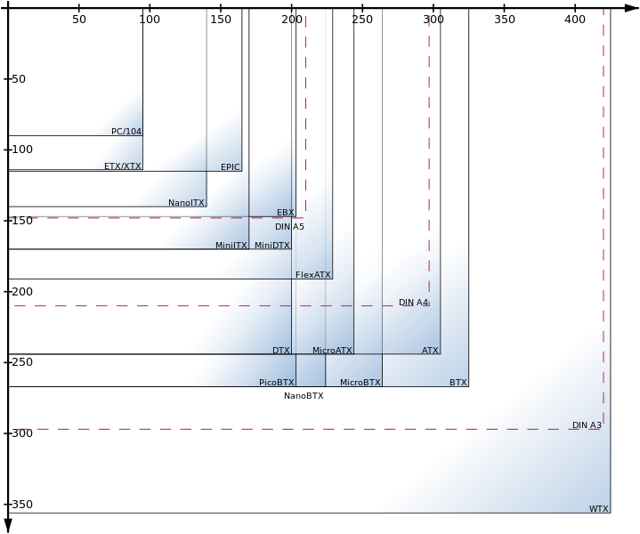

!!! note "Idea clave"
    El formato de la placa base condiciona la caja, la fuente de alimentación y la capacidad de expansión del equipo, pero no determina por sí solo el rendimiento.

**Esquema de interconexión de una placa base:**

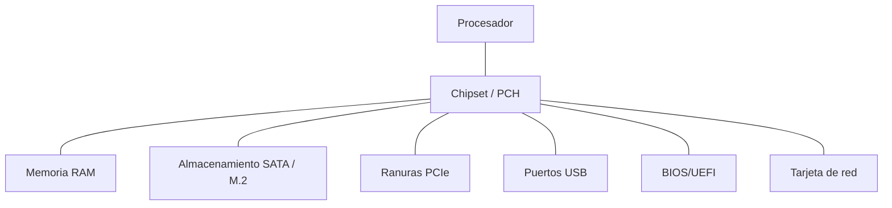

**El proceso de arranque (POST):** al encender el equipo, el firmware BIOS/UEFI de la placa base ejecuta el **POST** (*Power-On Self-Test*), una secuencia de comprobaciones automáticas del hardware básico antes de ceder el control al sistema operativo:

1. Al recibir alimentación, la placa base entrega el control al firmware BIOS/UEFI.
2. El POST comprueba, por orden, la memoria RAM, la tarjeta gráfica, el teclado/ratón y las unidades de almacenamiento conectadas.
3. Si todo es correcto, el firmware localiza el dispositivo de arranque según el orden configurado y le cede el control (sector de arranque MBR o partición EFI en GPT — ver 1.6).
4. Si detecta un fallo grave, detiene el arranque y lo notifica: en sistemas con **BIOS heredada (legacy)**, mediante una secuencia de pitidos (*beep codes*) del altavoz interno, ya que todavía no hay salida de vídeo; en el firmware **UEFI** moderno, habitualmente mediante un código o mensaje en pantalla, o un display/LEDs de diagnóstico en la propia placa.

???+ note "Códigos de pitidos POST (BIOS heredada)"
    El significado exacto varía según el fabricante del firmware (AMI, Award/Phoenix...), pero algunos patrones habituales son:

    | Patrón | Causa probable |
    | --- | --- |
    | 1 pitido corto | Arranque correcto |
    | Sin pitido y sin vídeo | Fuente de alimentación, placa base o altavoz interno mal conectado |
    | Pitidos repetidos cortos | Memoria RAM mal asentada o incompatible |
    | Pitido largo continuo | Fallo de alimentación o sobrecalentamiento |
    | 1 largo + 2/3 cortos | Tarjeta gráfica no detectada o mal conectada |

    Antes de sustituir cualquier componente conviene reasentar los módulos de memoria y la tarjeta gráfica, y revisar los cables de alimentación: la mayoría de estos errores tienen un origen mecánico, no una avería real.

???+ tip "Herramientas de verificación y diagnóstico"
    Más allá del propio POST, con el sistema operativo ya arrancado se usan utilidades específicas para comprobar el estado del hardware: **HWiNFO64** o **AIDA64** (identificación completa del hardware y sensores de temperatura/voltaje), **CPU-Z**/**GPU-Z** (verificación de procesador, memoria y tarjeta gráfica), **MemTest86** (test de estabilidad de la memoria RAM, arrancado desde USB) y **CrystalDiskInfo** (estado de salud S.M.A.R.T. de discos HDD/SSD).

## 1.4. El procesador: arquitectura, registros, unidad aritmético-lógica

El **procesador** (CPU) ejecuta las instrucciones de los programas. Sus bloques funcionales principales son:

- **Unidad de control (UC)**: interpreta las instrucciones y genera las señales que coordinan el resto de unidades.
- **Unidad aritmético-lógica (ALU)**: realiza operaciones aritméticas (suma, resta, multiplicación...) y lógicas (AND, OR, comparaciones).
- **Registros**: memorias muy pequeñas y extremadamente rápidas dentro del propio procesador, usadas para almacenar datos e instrucciones en curso. Algunos registros destacados:
    - **Contador de programa (PC)**: dirección de la siguiente instrucción a ejecutar.
    - **Registro de instrucción (IR)**: instrucción que se está decodificando/ejecutando.
    - **Acumulador y registros de propósito general**: operandos y resultados intermedios.
- **Memoria caché** (L1, L2, L3): niveles de memoria intermedia, cada vez más grandes y lentos a medida que se alejan del núcleo, que reducen los accesos a la memoria RAM.

**Ciclo de instrucción (fetch-decode-execute):**

1. **Fetch (búsqueda)**: se lee de memoria la instrucción señalada por el contador de programa.
2. **Decode (decodificación)**: la unidad de control interpreta qué operación hay que realizar.
3. **Execute (ejecución)**: la ALU (u otra unidad) realiza la operación.
4. **Almacenamiento del resultado** y actualización del contador de programa.

**Conjunto de instrucciones (ISA):** define el repertorio de instrucciones que el procesador es capaz de ejecutar. Las dos grandes filosofías de diseño son:

| | CISC | RISC |
| --- | --- | --- |
| Instrucciones | Muchas y complejas | Pocas y simples |
| Ciclos por instrucción | Variable, más ciclos | Habitualmente 1 ciclo |
| Ejemplos | x86 / x86-64 (Intel, AMD) | ARM, RISC-V |
| Uso típico | PC y servidores | Móviles, tablets, SoC embebidos |

**Interrupciones:** señales que indican al procesador que debe detener momentáneamente su tarea actual para atender un evento (por ejemplo, una pulsación de teclado o el aviso de un disco). El procesador guarda el estado actual, ejecuta la rutina de servicio de interrupción (ISR) asociada y retoma después la tarea interrumpida. Pueden ser:

- **Hardware**: generadas por un dispositivo físico (periférico, temporizador).
- **Software**: generadas por una instrucción del propio programa (por ejemplo, para solicitar un servicio del sistema operativo).

**Núcleos y hilos:** un procesador puede integrar varios **núcleos** (cores) capaces de ejecutar instrucciones de forma independiente y simultánea, y cada núcleo puede exponer varios **hilos de ejecución** lógicos (p. ej. mediante *Hyper-Threading*) para aprovechar mejor sus recursos internos.

**Otras características del procesador:**

- **Arquitectura de 32 o 64 bits**: tamaño de los datos y direcciones de memoria que el procesador maneja de forma nativa; condiciona, entre otras cosas, la cantidad máxima de memoria RAM direccionable (un sistema de 32 bits está limitado a 4 GB). Prácticamente todos los procesadores y sistemas operativos actuales son de 64 bits.
- **Proceso de fabricación (litografía)**: tamaño de los transistores del chip, medido en nanómetros (nm). Cuanto menor es esta medida, más transistores caben en la misma superficie, lo que generalmente se traduce en más rendimiento y menor consumo (por ejemplo, 14 nm, 10 nm, 7 nm, 5 nm...).
- **TDP (Thermal Design Power)**: potencia térmica de diseño, en vatios (W); indica el calor que el sistema de refrigeración debe ser capaz de disipar en condiciones normales de uso. Es un dato clave para elegir un disipador o *cooler* adecuado (ver 1.2) y para calcular el consumo y la fuente de alimentación necesaria.

## 1.5. Tipos y características de la memoria interna

La memoria interna se organiza en una **jerarquía** que equilibra velocidad, capacidad y coste: cuanto más rápida es una memoria, más cara y más pequeña suele ser.

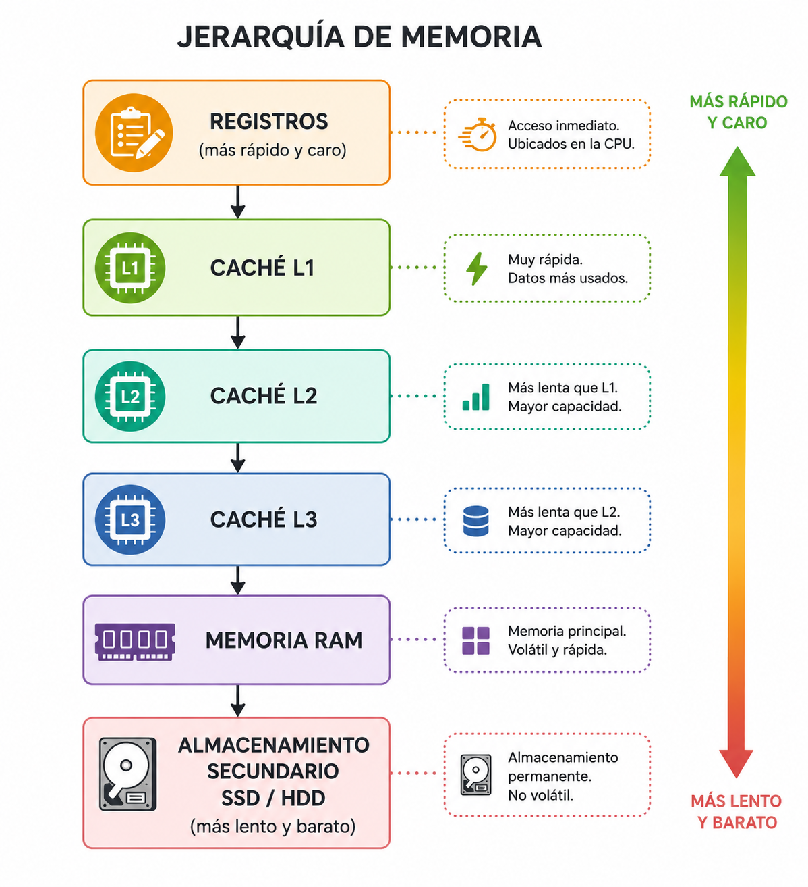

**RAM (Random Access Memory):** memoria volátil (pierde su contenido al apagar el equipo) donde se cargan el sistema operativo y los programas en ejecución.

- **DRAM** (Dynamic RAM): necesita refrescarse periódicamente; es la base de la memoria RAM principal. Tecnologías **DDR4** y **DDR5** son las generaciones actuales, caracterizadas por su frecuencia (MHz/MT/s), latencia (CL) y capacidad.
- **SRAM** (Static RAM): más rápida y cara que la DRAM, no necesita refresco; se usa en las memorias caché del procesador.

**Formato físico del módulo:** los zócalos de memoria de la placa base (ver 1.3) alojan módulos en formato **DIMM**, de tamaño estándar para equipos de sobremesa, o **SO-DIMM** (*Small Outline* DIMM), más compactos y utilizados en portátiles y equipos de formato reducido (Mini-ITX). Ambos existen en las mismas tecnologías (DDR4, DDR5...), pero no son intercambiables entre sí.

**Latencia (CAS Latency, CL):** número de ciclos de reloj que transcurren entre que el controlador de memoria solicita un dato y este está disponible en la salida; se expresa como una secuencia de valores (por ejemplo, CL16-18-18-36). A igual frecuencia, una latencia CL más baja implica una respuesta más rápida, aunque la latencia real en nanosegundos depende tanto del valor de CL como de la frecuencia del módulo.

**Canal dual/triple/cuádruple (Dual/Triple/Quad Channel):** las placas base modernas pueden acceder simultáneamente a dos, tres o cuatro módulos de memoria idénticos instalados en los zócalos correspondientes (identificables normalmente por su color en la placa), multiplicando el ancho de banda disponible respecto a un único módulo. Para aprovechar esta característica, los módulos deben instalarse por parejas o grupos de igual capacidad y velocidad, en los zócalos que indique el manual de la placa.

**Memoria de solo lectura (ROM) y variantes:** memorias no volátiles usadas tradicionalmente para almacenar firmware.

| Tipo | Se puede regrabar | Método de borrado/escritura |
| --- | --- | --- |
| ROM | No | Grabada de fábrica |
| PROM | Una vez | Grabación eléctrica única |
| EPROM | Sí | Borrado con luz ultravioleta |
| EEPROM | Sí | Borrado eléctrico, byte a byte |
| Memoria Flash | Sí | Borrado eléctrico por bloques (base de SSD, pendrives, BIOS/UEFI actuales) |

**Características que definen una memoria:**

- **Capacidad**: cantidad de información que puede almacenar (GB).
- **Velocidad/frecuencia**: ciclos por segundo a los que opera.
- **Latencia**: tiempo que tarda en responder a una solicitud.
- **Volatilidad**: si pierde o no la información al cortar la alimentación.
- **Ancho de banda**: cantidad de datos que puede transferir por unidad de tiempo.

## 1.6. Interfaces de entrada/salida, discos y unidades ópticas

Las **interfaces de entrada/salida (E/S)** son los buses y conectores que permiten a la placa base comunicarse con los dispositivos de almacenamiento y otros periféricos.

**Interfaces de almacenamiento más habituales:**

| Interfaz | Tipo de conexión | Velocidad orientativa | Uso típico |
| --- | --- | --- | --- |
| SATA III | Cable | 6 Gbit/s | HDD y SSD 2,5"/3,5" |
| M.2 (SATA) | Ranura directa en placa | 6 Gbit/s | SSD compactos |
| M.2 (NVMe, sobre PCIe) | Ranura directa en placa | Varios GB/s | SSD de alto rendimiento |
| USB (2.0/3.x/USB4) | Externa | 480 Mbit/s – 40 Gbit/s | Discos externos, pendrives |
| Thunderbolt | Externa | Hasta 40 Gbit/s | Almacenamiento externo de alta gama |

**Tipos de discos:**

- **HDD (disco duro magnético)**: platos magnéticos giratorios y cabezal de lectura/escritura; gran capacidad a bajo coste, pero más lento y sensible a golpes. Sus partes físicas principales son el plato, el brazo, el cabezal y el eje; a nivel lógico se organiza en un sector de arranque (MBR/GPT), una tabla de particiones y las particiones. Su rendimiento depende de varias características: la **velocidad de rotación** (RPM), el **tiempo de acceso** (lo que tarda el cabezal en posicionarse sobre el dato buscado), la **caché del disco** (memoria intermedia que amortigua lecturas/escrituras) y la velocidad de transferencia, tanto interna (plato-caché) como externa (caché-interfaz).
- **SSD (unidad de estado sólido)**: memoria flash sin partes móviles; mucha mayor velocidad de lectura/escritura y resistencia física, coste por GB más alto.
- **Discos híbridos (SSHD)**: combinan un HDD con una pequeña caché en SSD.

!!! note "SSD frente a HDD: ventajas e inconvenientes"
    - **Ventajas**: arranque y carga de aplicaciones más rápidos, mayor velocidad de lectura/escritura, tiempo de acceso y latencia mucho menores, resistencia a golpes y vibraciones (sin partes mecánicas), funcionamiento silencioso, menor consumo y generación de calor.
    - **Inconvenientes**: mayor precio por GB, menor capacidad máxima disponible que un HDD equivalente, y peor recuperación de datos en caso de fallo (la información de una celda dañada suele perderse por completo).

!!! note "Idea clave"
    La interfaz (SATA, NVMe...) determina el **ancho de banda máximo teórico**; el tipo de disco (HDD/SSD) determina el rendimiento real de acceso a los datos. Un SSD SATA está limitado por la interfaz, mientras que un SSD NVMe aprovecha directamente el bus PCIe.

**Unidades y soportes ópticos:** los lectores/grabadores ópticos leen y graban datos mediante un láser que incide sobre la superficie del disco, distinguiendo zonas con distinta reflectividad (*land* y *pit*). A menor longitud de onda del láser, menor es el punto que puede leer y mayor la capacidad del soporte:

| Soporte | Capacidad orientativa | Tecnología de láser |
| --- | --- | --- |
| CD | 700 MB | Láser infrarrojo |
| DVD | 4,7 GB (capa simple) | Láser rojo |
| Blu-ray | 25 GB (capa simple) | Láser azul |

Cada soporte existe además en varias variantes según su capacidad de grabación: **-ROM** (solo lectura, grabado de fábrica), **-R** (grabable una única vez) y **-RW** (regrabable). El DVD, al admitir una o dos caras y una o dos capas por cara, ofrece varias capacidades posibles (4,7 GB a una cara/capa, hasta 17 GB a dos caras y dos capas).

**Tarjetas de memoria flash:** soportes de almacenamiento extraíbles de estado sólido, muy utilizados en cámaras, móviles y otros dispositivos portátiles. Existen varios formatos (SD, microSD, miniSD, CompactFlash, Memory Stick...), con distinta capacidad, velocidad y tamaño físico; los lectores de tarjetas suelen admitir varios formatos mediante adaptadores.

## 1.7. Tarjetas de expansión

Las **tarjetas de expansión** son dispositivos con circuitos integrados que se insertan en las ranuras de expansión de la placa base (habitualmente PCIe) para ampliar las capacidades del equipo. Las más habituales son:

- **Tarjeta gráfica (GPU)**: genera la imagen que se envía al monitor; imprescindible en equipos con necesidades gráficas exigentes (diseño, edición de vídeo, videojuegos), aunque muchos procesadores ya integran gráficos básicos. Sus conectores de salida actuales son **HDMI** y **DisplayPort** (vídeo y audio digital de alta definición); VGA y DVI son conectores más antiguos, en desuso. Las tarjetas de gama alta necesitan alimentación adicional de la fuente mediante conectores PCIe de 6/8 pines, además de la que reciben de la propia ranura.
- **Tarjeta de sonido**: procesa el audio de entrada y salida; la mayoría de placas base ya integran una, por lo que una tarjeta dedicada solo se justifica para necesidades de audio profesional.
- **Tarjeta de red** (cableada o inalámbrica): permite conectar el equipo a una red, cuando la placa base no la integra o se necesita una interfaz adicional. Cada tarjeta tiene una **dirección MAC** única de fábrica; las cableadas alcanzan velocidades Ethernet/Fast Ethernet/Gigabit (10/100/1000 Mbps) y muchas admiten **Wake on LAN**, que permite encender el equipo de forma remota a través de la red.
- **Tarjeta capturadora/sintonizadora de vídeo o TV**: permite capturar vídeo de una fuente externa o recibir la señal de televisión.
- **Tarjeta controladora (PCI-SCSI, expansión USB, Firewire...)**: añade puertos o interfaces adicionales de los que la placa base no dispone o que se han quedado insuficientes.

!!! note "Tecnologías en desuso"
    Hace unos años era habitual combinar dos tarjetas gráficas idénticas para sumar su potencia (**SLI** en Nvidia, **Crossfire** en AMD). Hoy en día ambos fabricantes la han abandonado casi por completo, en favor de tarjetas individuales cada vez más potentes.

## 1.8. Periféricos: clasificación, instalación y configuración

Un **periférico** es cualquier dispositivo que se conecta al ordenador para introducir, extraer o intercambiar información con él.

**Clasificación según el sentido del flujo de información:**

- **Entrada**: introducen datos al sistema. Ej.: teclado, ratón, escáner, cámara, micrófono.
- **Salida**: el sistema emite información hacia ellos. Ej.: monitor, impresora, altavoces.
- **Entrada/salida (mixtos)**: permiten ambos sentidos. Ej.: pantalla táctil, módem, dispositivos de almacenamiento externo, tarjetas de red.

**Proceso de instalación de un periférico:**

1. **Conexión física** mediante la interfaz correspondiente (USB, HDMI, Bluetooth, etc.).
2. **Detección** por parte del sistema operativo.
3. **Instalación del controlador (driver)**: software que traduce las órdenes del sistema operativo a comandos específicos del dispositivo. Puede instalarse automáticamente (**Plug & Play**) o requerir un driver del fabricante.
4. **Configuración**: ajuste de parámetros específicos (resolución, calidad de impresión, sensibilidad, perfiles de color, etc.) desde el propio sistema operativo o desde software del fabricante.

!!! warning "Plug & Play no siempre es suficiente"
    Aunque la mayoría de periféricos actuales son *Plug & Play*, algunos dispositivos (impresoras multifunción, tarjetas gráficas, capturadoras...) requieren instalar manualmente el driver o el paquete de software completo del fabricante para funcionar con todas sus prestaciones.

## 1.9. Normativa de seguridad y prevención de riesgos laborales

El trabajo con equipos informáticos está sujeto a la **Ley 31/1995 de Prevención de Riesgos Laborales (LPRL)** y, específicamente para puestos con pantallas de visualización de datos, al **Real Decreto 488/1997**.

**Principales riesgos al manipular equipos informáticos:**

- **Riesgo eléctrico**: contacto con partes bajo tensión, cortocircuitos. Medidas: desconectar el equipo de la red eléctrica antes de manipular componentes internos, no trabajar con las manos húmedas, usar herramientas aisladas.
- **Descargas electrostáticas (ESD)**: la electricidad estática del cuerpo puede dañar componentes electrónicos sensibles (placas, memorias, procesadores). Medidas: usar **muñequera antiestática** conectada a tierra, manipular los componentes por los bordes, guardarlos en bolsas antiestáticas.
- **Riesgos ergonómicos**: posturas forzadas, movimientos repetitivos, fatiga visual por el uso prolongado de pantallas. Medidas: altura correcta de silla y pantalla, pausas periódicas, iluminación adecuada.
- **Manipulación manual de cargas**: al mover equipos pesados (torres, servidores, SAI). Medidas: técnicas correctas de levantamiento, uso de ayudas mecánicas.

!!! warning "Antes de abrir un equipo"
    Desconectar siempre el cable de alimentación (no basta con apagarlo) y utilizar muñequera antiestática antes de manipular componentes internos.

## 1.10. Búsqueda y gestión de documentación técnica en Internet

Una parte importante del trabajo con sistemas informáticos consiste en localizar, evaluar y organizar documentación técnica: manuales de fabricante, hojas de características (*datasheets*), foros especializados, documentación oficial de fabricantes de hardware y software, o estándares técnicos.

**Fuentes habituales de documentación técnica:**

- **Documentación oficial del fabricante**: manuales, *datasheets*, notas de la versión (release notes), bases de conocimiento (knowledge base).
- **Documentación de proyectos de software**: wikis y documentación oficial (por ejemplo, la de una distribución Linux o un sistema operativo).
- **Foros y comunidades técnicas**: útiles para resolver incidencias concretas, pero conviene contrastar la información.
- **Estándares y organismos**: RFC (Internet), IEEE, ISO.

**Criterios para evaluar la fiabilidad de una fuente:**

- Autoría reconocida (fabricante, organismo oficial, comunidad consolidada).
- Fecha de publicación/actualización (la documentación técnica queda obsoleta rápido).
- Coherencia con la versión exacta del producto que se está utilizando.
- Contraste entre varias fuentes ante información dudosa o contradictoria.

!!! tip "Buenas prácticas de búsqueda"
    - Acotar la búsqueda incluyendo el nombre exacto del producto y su número de versión.
    - Usar operadores de búsqueda avanzada (comillas para frases exactas, `site:` para limitar a un dominio, `filetype:` para tipos de archivo concretos).
    - Guardar y organizar la documentación relevante (marcadores, gestores de notas) para no tener que volver a buscarla.

## Catálogo visual de componentes

Antes de hacer la **Actividad 1.1**, consulta el **[catálogo visual de componentes](catalogo-componentes.md)**: fotografías reales de placas base, procesadores, memoria, almacenamiento, tarjetas y dispositivos de red, y periféricos, con los rasgos que ayudan a reconocer cada uno físicamente.

## Actividades

**Actividad 1.1 — Diagnóstico de un equipo desmontado**
{: .actividad-titulo}

Con un equipo de sobremesa desmontado (o un catálogo de imágenes proporcionado por el profesorado), identifica y fotografía/etiqueta: chasis (formato) y fuente de alimentación, sistema de refrigeración, placa base (formato), procesador y zócalo, módulos de memoria RAM, unidades de almacenamiento e interfaz que usan, alguna tarjeta de expansión si el equipo dispone de ella, y al menos tres periféricos con su tipo de conector. Elabora una ficha técnica del equipo a partir de esta **[plantilla de ficha técnica](plantilla-ficha-tecnica.md)**.

**Actividad 1.2 — Identifica los elementos de una placa base (modelo antiguo)**
{: .actividad-titulo}

Esta placa base es una **Foxconn P55MX/H55MX**, con zócalo **LGA1156** y chipset **Intel P55** — una gama pensada para los primeros Core i5/i7 ("Lynnfield"), de en torno a **2009-2010**. Consulta el **[catálogo visual de componentes](catalogo-componentes.md)** si lo necesitas y, antes de mirar la solución, intenta identificar tú mismo/a los 23 elementos señalados.

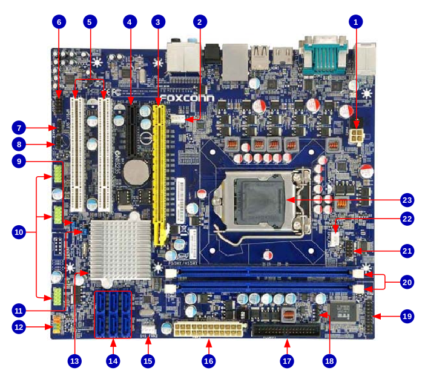

??? note "Solución"
    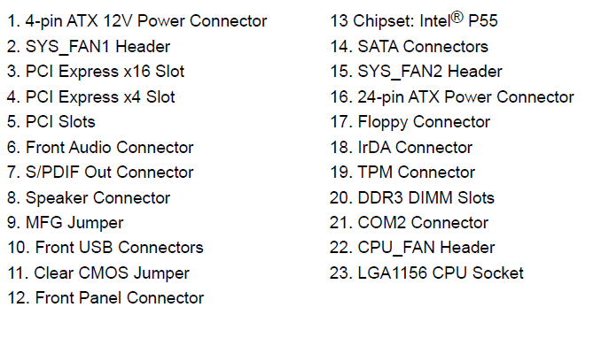

**Actividad 1.3 — Identifica los elementos de una placa base (modelo actual)**
{: .actividad-titulo}

Repite el ejercicio anterior sobre esta placa base más reciente, una **ASUS Prime X570-P** (zócalo **AM4**, chipset **AMD X570**, de **2019**, con ranuras DDR4 y M.2). Compárala con la de la actividad anterior: ¿qué elementos han cambiado de aspecto o posición y cuáles siguen cumpliendo la misma función?

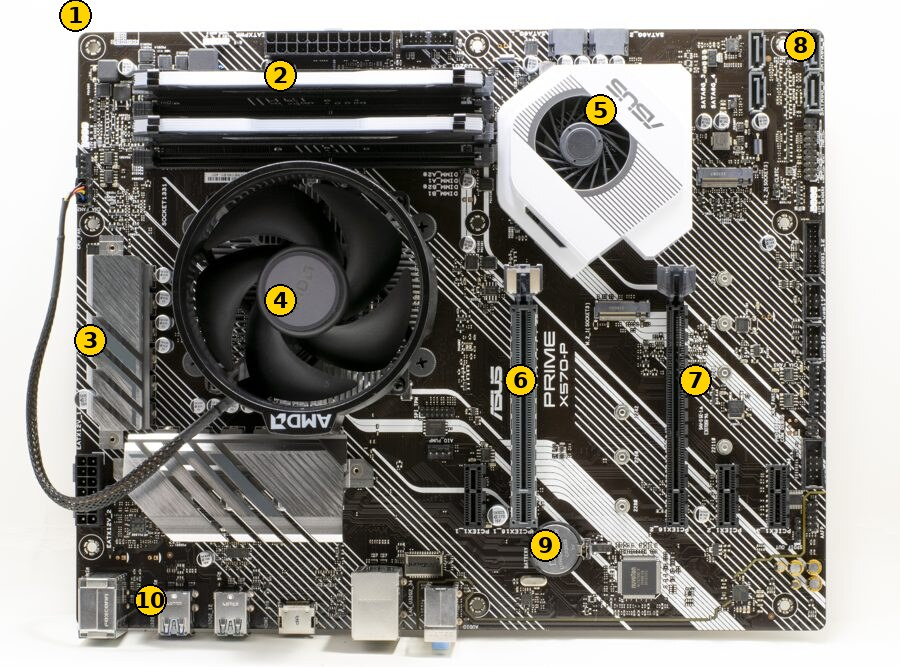

??? note "Solución"
    1. Conector de alimentación ATX (24 pines)
    2. Ranuras de memoria RAM (DIMM, DDR4)
    3. Disipador de los reguladores de voltaje (VRM)
    4. Procesador y disipador (zócalo AM4, procesador oculto bajo el cooler)
    5. Chipset (X570) con ventilador activo
    6. Ranura PCIe x16 (nº1, para la tarjeta gráfica principal)
    7. Ranura PCIe x16 (nº2)
    8. Conectores SATA
    9. Batería CMOS
    10. Panel de E/S trasero (USB, red, audio...)

**Actividad 1.4 — CISC vs. RISC**
{: .actividad-titulo}

Elabora una tabla comparativa entre arquitecturas CISC y RISC, y busca al menos tres dispositivos reales (PC, smartphone, consola, microcontrolador) indicando qué arquitectura de procesador utiliza cada uno y por qué crees que se eligió.

**Actividad 1.5 — Memoria RAM: comparación de módulos**
{: .actividad-titulo}

Se dispone de tres módulos de memoria con estas características:

| Módulo | Formato | Capacidad | Frecuencia | CAS Latency (CL) |
| --- | --- | --- | --- | --- |
| A | DIMM DDR4 | 8 GB | 3200 MT/s | CL16 |
| B | DIMM DDR4 | 8 GB | 2666 MT/s | CL19 |
| C | SO-DIMM DDR4 | 8 GB | 3200 MT/s | CL22 |

a) ¿En qué tipo de equipo instalarías cada módulo? ¿Cuáles son físicamente compatibles entre sí y cuáles no, y por qué?

b) ¿Formarían A y B una pareja válida en **Dual Channel** en una placa de sobremesa? Razona qué ocurriría realmente si se instalan juntas.

c) Calcula la latencia real aproximada, en nanosegundos, de los módulos A y C con la fórmula `latencia (ns) = (CL / frecuencia) × 2000`. A pesar de tener la misma frecuencia nominal, ¿cuál responde antes a una solicitud de datos? ¿Qué te dice esto sobre fiarse solo de la frecuencia a la hora de comparar memorias?

d) Busca en el **[catálogo visual de componentes](catalogo-componentes.md)** una fotografía de un módulo DIMM y otra de un módulo SO-DIMM, y señala dos diferencias visuales entre ambos.

**Actividad 1.6 — Interfaces de almacenamiento y tarjetas de expansión**
{: .actividad-titulo}

Consulta el **[catálogo visual de componentes](catalogo-componentes.md)** y responde:

a) Ordena de menor a mayor ancho de banda teórico estos tres dispositivos, indicando la interfaz más probable de cada uno: un disco duro de 3,5" de un equipo de sobremesa, un SSD M.2 de un portátil ultrafino, y un disco externo conectado por USB 3.0.

b) Un equipo de sobremesa necesita capturar vídeo de una cámara externa y su placa base no incluye esa función. ¿Qué tipo de tarjeta de expansión instalarías, y en qué tipo de ranura de la placa base?

c) Un SSD SATA y un SSD M.2 NVMe tienen la misma capacidad. Explica por qué el NVMe puede ofrecer mucha más velocidad, y en qué situación un disco externo por Thunderbolt superaría a uno conectado por USB 3.0.

**Actividad 1.7 — Checklist de seguridad antes de manipular un equipo**
{: .actividad-titulo}

Redacta un checklist de comprobaciones de seguridad (riesgo eléctrico, ESD, ergonomía) que un técnico debería seguir antes de abrir la carcasa de un PC para ampliar la memoria RAM. Justifica cada punto citando el riesgo que previene.

**Actividad 1.8 — Búsqueda de documentación técnica**
{: .actividad-titulo}

Busca la hoja de características (*datasheet*) oficial de cada uno de estos módulos de memoria RAM:

- Corsair Vengeance LPX 8 GB DDR4-3200 (DIMM, sobremesa)
- Kingston FURY Impact 8 GB DDR4-3200 (SO-DIMM, portátil)
- Corsair Vengeance 16 GB DDR5-5600 (DIMM, sobremesa)
- Crucial 8 GB DDR5-4800 (SO-DIMM, portátil)

Para cada módulo, extrae sus características principales (capacidad, velocidad, CAS Latency, voltaje, interfaz) y cita la URL exacta del datasheet utilizado, valorando su fiabilidad (¿es la web oficial del fabricante? ¿está actualizado?). Presenta los resultados en una tabla comparativa.
