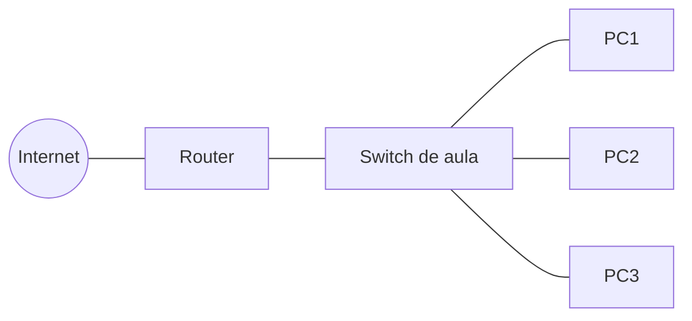
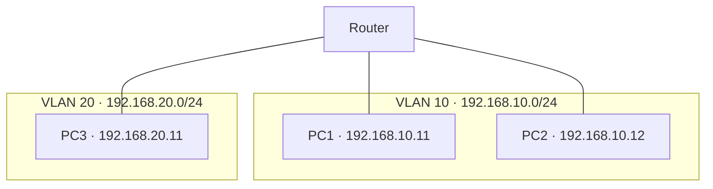

# UT4. Redes y sistemas operativos en red

!!! tip "Duración"
    35 horas

!!! abstract "Resultados de aprendizaje que se trabajan"
    **RA5.** Interconecta sistemas en red configurando dispositivos y protocolos.

    **RA6.** Opera sistemas en red gestionando sus recursos e identificando restricciones de seguridad.

    *Transversal:* **RA7** (parcial) — uso de sistemas de correo y mensajería y de servicios de transferencia de ficheros.

## 4.1. Fundamentos de redes: tipos, topologías y componentes

Una **red informática** es un conjunto de dispositivos interconectados que comparten recursos (datos, impresoras, conexión a Internet) y se comunican mediante un conjunto de reglas (protocolos).

**Tipos de redes según su extensión geográfica:**

| Tipo | Nombre | Alcance típico |
| --- | --- | --- |
| PAN | Personal Area Network | Unos pocos metros (Bluetooth, USB) |
| LAN | Local Area Network | Un edificio o campus |
| WLAN | Wireless LAN | LAN inalámbrica (Wi-Fi) |
| MAN | Metropolitan Area Network | Una ciudad |
| WAN | Wide Area Network | Países o continentes (ej. Internet) |

**Topologías de red** (disposición física o lógica de los dispositivos):

- **Bus**: todos los equipos comparten un mismo cable troncal. Sencilla pero un fallo en el cable afecta a toda la red.
- **Estrella**: todos los equipos se conectan a un dispositivo central (switch). Es la topología física más usada actualmente; un fallo en un equipo no afecta al resto.
- **Anillo**: cada equipo se conecta a otros dos formando un círculo cerrado.
- **Árbol**: combinación jerárquica de varias topologías en estrella.
- **Malla**: cada equipo se conecta con varios (o todos) los demás, aportando redundancia y tolerancia a fallos, a costa de más cableado.

=== "Bus"

    ```mermaid
    graph LR
        PC1[Equipo 1] --- Bus[Cable troncal]
        PC2[Equipo 2] --- Bus
        PC3[Equipo 3] --- Bus
        PC4[Equipo 4] --- Bus
    ```

=== "Estrella"

    ```mermaid
    graph TD
        S((Switch)) --- PC1[Equipo 1]
        S --- PC2[Equipo 2]
        S --- PC3[Equipo 3]
        S --- PC4[Equipo 4]
    ```

=== "Anillo"

    ```mermaid
    graph LR
        PC1[Equipo 1] --> PC2[Equipo 2]
        PC2 --> PC3[Equipo 3]
        PC3 --> PC4[Equipo 4]
        PC4 --> PC1
    ```

=== "Malla"

    ```mermaid
    graph TD
        PC1[Equipo 1] --- PC2[Equipo 2]
        PC1 --- PC3[Equipo 3]
        PC1 --- PC4[Equipo 4]
        PC2 --- PC3
        PC2 --- PC4
        PC3 --- PC4
    ```

**Componentes principales de una red informática:**

- **Tarjeta de red (NIC)**: interfaz que conecta un equipo a la red, con una dirección MAC única.
- **Switch (conmutador)**: interconecta equipos dentro de una misma LAN, dirigiendo el tráfico según la dirección MAC de destino.
- **Router (encaminador)**: interconecta redes distintas y decide la ruta que deben seguir los paquetes entre ellas.
- **Punto de acceso (AP)**: da conectividad inalámbrica a los dispositivos de una WLAN.
- **Hub (concentrador)**: dispositivo antiguo que repite el tráfico a todos los puertos por igual (en desuso, sustituido por el switch).
- **Medio de transmisión**: cable de cobre, fibra óptica u ondas de radio, según el caso.

!!! note "Idea clave"
    Este apartado da una visión general de los componentes de red; el punto 4.5 profundiza en el funcionamiento de switch y router (tablas de conmutación y de encaminamiento, NAT).

## 4.2. Cableado, conectores y mapa físico/lógico de una red local

**Tipos de cableado más habituales en redes LAN:**

| Cableado | Descripción | Uso |
| --- | --- | --- |
| UTP (par trenzado no apantallado) | 4 pares trenzados, sin blindaje | Redes de oficina y hogar |
| STP/FTP (par trenzado apantallado) | Igual que UTP pero con blindaje | Entornos con interferencias electromagnéticas |
| Coaxial | Conductor central + malla | Prácticamente en desuso en LAN |
| Fibra óptica | Transmisión por pulsos de luz | Backbones, largas distancias, alta velocidad |

**Categorías de cable UTP/FTP** (a mayor categoría, mayor ancho de banda soportado): Cat 5e (hasta 1 Gbit/s), Cat 6 (hasta 10 Gbit/s a distancias cortas), Cat 6A y Cat 7/8 (10 Gbit/s y más, mayor apantallamiento).

**Conectores más comunes:**

- **RJ-45**: conector del cableado de par trenzado (Ethernet).
- **SC / LC**: conectores típicos de fibra óptica.

**Tipos de cable UTP según el cableado interno:**

- **Cable directo (straight-through)**: los pines siguen el mismo orden en ambos extremos. Se usa para conectar dispositivos de distinto nivel (equipo-switch, switch-router).
- **Cable cruzado (crossover)**: los pares de transmisión y recepción están cruzados. Se usa tradicionalmente para conectar dispositivos del mismo nivel (switch-switch, PC-PC), aunque la mayoría de equipos actuales incorporan detección automática (*Auto-MDI-X*) y ya no lo requieren.

**Mapa físico vs. mapa lógico de una red:**

- **Mapa físico**: representa la ubicación real de los dispositivos, el cableado y su disposición en el espacio (racks, plantas, salas).
- **Mapa lógico**: representa cómo fluye la información entre los dispositivos con independencia de su ubicación física: direccionamiento IP, segmentación en subredes/VLAN, rutas.

**Mapa físico** (disposición real de los equipos y el cableado):



**Mapa lógico** (segmentación en subredes/VLAN, con independencia de la ubicación física):



!!! note "Idea clave"
    Dos equipos pueden estar físicamente muy cerca (mismo armario de comunicaciones) y pertenecer a segmentos lógicos completamente distintos (VLAN distintas), y viceversa.

## 4.3. Protocolo TCP/IP: direccionamiento IPv4/IPv6, DNS

**TCP/IP** es el conjunto de protocolos que hace posible la comunicación en la mayoría de redes actuales, incluida Internet. Se organiza en capas, donde cada una se apoya en los servicios de la inferior:

| Capa (modelo TCP/IP) | Función | Ejemplos de protocolo |
| --- | --- | --- |
| Aplicación | Servicios usados directamente por los programas | HTTP, DNS, SMTP, FTP |
| Transporte | Comunicación extremo a extremo | TCP (fiable), UDP (sin conexión) |
| Internet | Direccionamiento y encaminamiento entre redes | IP, ICMP |
| Acceso a la red | Transmisión física de los datos | Ethernet, Wi-Fi |

**Direccionamiento IPv4:** dirección de 32 bits, representada en 4 grupos decimales (0-255) separados por puntos (p. ej. `192.168.1.10`).

- **Máscara de subred**: determina qué parte de la dirección identifica la red y cuál el equipo (host). Se puede expresar en notación decimal (`255.255.255.0`) o **CIDR** (`/24`).
- **Direcciones privadas** (uso interno, no enrutables en Internet): `10.0.0.0/8`, `172.16.0.0/12`, `192.168.0.0/16`.
- **Puerta de enlace (gateway)**: dirección del dispositivo (router) por el que un equipo envía el tráfico destinado a otras redes.

**IPv6:** dirección de 128 bits, representada en 8 grupos hexadecimales (p. ej. `2001:0db8:0000:0000:0000:ff00:0042:8329`, simplificable a `2001:db8::ff00:42:8329`), diseñada para resolver el agotamiento de direcciones de IPv4 y simplificar el direccionamiento.

**DNS (Domain Name System):** servicio distribuido y jerárquico que traduce nombres de dominio legibles (`www.ejemplo.com`) a direcciones IP. En el proceso de **resolución**, el equipo consulta a un servidor DNS (a menudo el del proveedor de Internet o uno público como `8.8.8.8`), que responde directamente si conoce la respuesta o la reenvía a otros servidores DNS hasta obtenerla.

## 4.4. Configuración de redes cableadas e inalámbricas

**Configuración de la dirección IP de un equipo:**

- **Estática**: se asigna manualmente (IP, máscara, puerta de enlace, DNS). Habitual en servidores e impresoras, donde interesa que la dirección no cambie.
- **Dinámica (DHCP)**: un servidor **DHCP** asigna automáticamente la configuración de red a cada equipo que se conecta, durante un tiempo determinado (concesión o *lease*). Es la opción por defecto en la mayoría de redes domésticas y de oficina.

| SO | Configuración gráfica | Comandos / archivos |
| --- | --- | --- |
| Windows | Configuración > Red e Internet | `netsh`, PowerShell `Get-NetIPConfiguration` |
| Linux | NetworkManager (GUI) | `nmcli`, `/etc/netplan/*.yaml` (Ubuntu), `ip` |

**Redes inalámbricas (Wi-Fi):**

- **SSID**: nombre que identifica la red inalámbrica.
- **Estándares 802.11**: sucesivas generaciones (a/b/g/n/ac/ax...) con mejoras de velocidad y alcance; los nombres comerciales actuales son Wi-Fi 4 (802.11n), Wi-Fi 5 (802.11ac) y Wi-Fi 6 (802.11ax).
- **Seguridad**: protocolos de cifrado del tráfico inalámbrico, de menor a mayor seguridad: WEP (obsoleto e inseguro) → WPA → **WPA2** (estándar durante años) → **WPA3** (actual).
- **Ampliación de cobertura**: un único punto de acceso no siempre cubre todo el espacio necesario. Un **repetidor** (o un AP en modo repetidor, mediante el estándar **WDS**, *Wireless Distribution System*) retransmite la señal para ampliar el alcance, a costa de reducir el ancho de banda disponible en cada salto adicional. Las **redes mesh** modernas (varios puntos que se coordinan entre sí, con el mismo SSID e itinerancia automática entre ellos) resuelven el mismo problema de forma más eficiente y con gestión centralizada.

## 4.5. Dispositivos de interconexión y encaminamiento

- **Switch (conmutador)**: opera a nivel de enlace, interconectando equipos de una misma LAN. Aprende qué dirección **MAC** está conectada a cada puerto (tabla de conmutación) y reenvía el tráfico solo al puerto correspondiente, en lugar de a todos (a diferencia del antiguo hub).
- **Router (encaminador)**: opera a nivel de red, interconectando redes distintas (por ejemplo, la LAN doméstica con Internet). Mantiene una **tabla de encaminamiento (routing table)** que indica por qué interfaz/siguiente salto se debe enviar el tráfico según la red de destino.

**Tipos de encaminamiento:**

- **Estático**: las rutas se configuran manualmente; sencillo pero poco escalable.
- **Dinámico**: los routers intercambian información de rutas automáticamente mediante protocolos de encaminamiento (p. ej. OSPF, RIP), adaptándose a cambios en la red.

**NAT (Network Address Translation):** técnica, habitual en routers domésticos, que traduce las direcciones IP privadas de la LAN a una única IP pública para acceder a Internet, permitiendo que muchos equipos compartan una sola dirección pública.

**VLAN (Virtual LAN):** segmenta lógicamente una misma red física en varias redes independientes, sin necesidad de cablear switches separados. Requiere un **switch gestionable** (o switch L3), en cuya configuración se asignan los puertos a una VLAN u otra.

- **Puerto de acceso (access)**: pertenece a una única VLAN; es el modo habitual para conectar equipos finales (PC, impresora).
- **Puerto troncal (trunk)**: transporta el tráfico de varias VLAN a la vez, etiquetando cada trama con el identificador de VLAN correspondiente (estándar **802.1Q**); se usa para enlazar switches entre sí o conectar un router que hace de puerta de enlace de varias VLAN.

!!! note "Idea clave"
    Dos equipos conectados al mismo switch físico, pero en VLAN distintas, no pueden comunicarse entre sí sin pasar por un router (o una función de encaminamiento entre VLAN) — exactamente igual que si estuvieran en dos redes físicamente separadas.

## 4.6. Acceso a redes de área extensa y seguridad en comunicaciones

**Tecnologías de acceso a redes WAN / Internet:**

| Tecnología | Medio | Características |
| --- | --- | --- |
| ADSL | Par de cobre telefónico | Velocidad asimétrica, en desuso |
| Cable (DOCSIS) | Coaxial | Compartido por zona, buena velocidad de bajada |
| Fibra óptica (FTTH) | Fibra hasta el hogar | Alta velocidad simétrica, tecnología actual de referencia |
| Redes móviles | Radiofrecuencia | 4G/5G, cobertura amplia, uso también fijo (FWA) |

**VPN (Virtual Private Network):** crea un túnel cifrado a través de una red no confiable (como Internet), permitiendo acceder de forma segura a una red privada remota como si el equipo estuviera físicamente conectado a ella. Muy usada para el teletrabajo y para interconectar sedes de una empresa.

**Servidor proxy:** actúa como intermediario entre los equipos de una red local e Internet, reenviando las peticiones en su nombre. Es habitual en redes de empresas o centros educativos, con dos funciones principales:

- **Caché de contenidos**: guarda copia de los recursos más solicitados, reduciendo el consumo de ancho de banda y acelerando el acceso a lo que ya han consultado otros equipos de la red.
- **Filtrado de contenidos**: permite bloquear el acceso a determinados sitios o categorías (redes sociales, contenido no apropiado...) de forma centralizada, sin configurar cada equipo por separado.

**Squid** es la implementación libre de proxy más extendida en entornos Linux.

!!! note "Idea clave"
    Un proxy actúa en nombre del cliente hacia Internet (*forward proxy*); no debe confundirse con un **proxy inverso** (*reverse proxy*), que actúa en nombre de un servidor hacia sus clientes y que se estudia en otros módulos relacionados con el despliegue de aplicaciones web.

**Protocolos seguros de comunicación:**

| Protocolo inseguro | Alternativa segura |
| --- | --- |
| HTTP | **HTTPS** (HTTP sobre TLS/SSL) |
| Telnet | **SSH** |
| FTP | **FTPS** / **SFTP** |

**TLS/SSL:** protocolos que cifran la comunicación entre cliente y servidor, garantizando confidencialidad (nadie puede leer los datos), integridad (no se pueden modificar sin detectarlo) y autenticidad (mediante certificados digitales).

## 4.7. Recursos compartidos, permisos de red y directivas

Compartir un recurso (carpeta, impresora) en red implica dos niveles de permisos que se combinan:

- **Permisos de recurso compartido (permisos de red)**: se aplican solo al acceder desde la red (por ejemplo, "Lectura" o "Lectura/Escritura" al compartir una carpeta en Windows).
- **Permisos locales del sistema de archivos** (NTFS o los permisos Linux vistos en la UT3): se aplican siempre, se acceda local o remotamente.

!!! note "Idea clave"
    Cuando ambos niveles de permisos existen (típico en Windows), se aplica el **más restrictivo** de los dos. Por ejemplo, si el recurso compartido permite "control total" pero el permiso NTFS de la carpeta es "solo lectura", el resultado final es solo lectura.

**Modelos de administración de una red:**

- **Grupo de trabajo (workgroup)**: cada equipo gestiona sus propios usuarios y permisos de forma independiente; adecuado para redes muy pequeñas.
- **Dominio**: la gestión de usuarios, equipos y directivas se centraliza en un servidor (ver 4.10); adecuado a partir de cierto número de equipos.

**Unidades de red:** una carpeta compartida remota puede **mapearse** como si fuera una unidad más del propio equipo, facilitando su uso habitual.

## 4.8. Servidores de archivos, impresión y aplicaciones

- **Servidor de archivos**: centraliza el almacenamiento y el acceso a carpetas y documentos compartidos por varios usuarios, con sus correspondientes permisos. Puede implementarse con Windows Server, con **Samba** (que permite a un servidor Linux compartir recursos usando el protocolo SMB de Windows), o mediante dispositivos **NAS** dedicados.
- **Servidor de impresión**: centraliza la gestión de una o varias impresoras, permitiendo que los equipos de la red impriman sin necesidad de tener el dispositivo conectado directamente ni el driver instalado en cada equipo. Gestiona colas de impresión y prioridades.
- **Servidor de aplicaciones**: ejecuta la lógica de una aplicación y la sirve a los clientes de la red (por ejemplo, un ERP o una aplicación web), de forma que los equipos cliente no necesitan tener instalada ni ejecutar la aplicación localmente.

## 4.9. Conexión remota y cortafuegos

**Técnicas de conexión remota**, para administrar un equipo sin acceso físico a él:

| Protocolo/herramienta | Tipo de acceso | SO típico |
| --- | --- | --- |
| **RDP** (Remote Desktop Protocol) | Escritorio remoto gráfico | Windows |
| **SSH** (Secure Shell) | Línea de comandos cifrada | Linux (y disponible en Windows) |
| **VNC** | Escritorio remoto gráfico | Multiplataforma |
| TeamViewer / AnyDesk | Escritorio remoto gráfico, suele atravesar NAT sin configuración | Multiplataforma |

**Cortafuegos (firewall):** sistema (hardware o software) que filtra el tráfico de red entrante y saliente según un conjunto de reglas, permitiendo o bloqueando conexiones según criterios como el puerto, el protocolo o la dirección IP de origen/destino.

| SO | Herramienta |
| --- | --- |
| Windows | Firewall de Windows Defender |
| Linux | `iptables` / `nftables`, con interfaces simplificadas como `ufw` (Ubuntu) o `firewalld` (Fedora/RHEL) |

!!! warning "Puertos abiertos = superficie de ataque"
    Cada puerto abierto en un cortafuegos es un posible punto de entrada. La buena práctica es aplicar el principio de mínimo privilegio también en red: abrir únicamente los puertos estrictamente necesarios para los servicios que se ofrecen.

## 4.10. Dominios: implantación y explotación

Un **dominio** (en el ecosistema Windows, típicamente **Active Directory**) centraliza en uno o varios servidores llamados **controladores de dominio** la gestión de usuarios, equipos, grupos y directivas de seguridad de toda una organización.

**Ventajas frente al modelo de grupo de trabajo:**

- Inicio de sesión único (el mismo usuario y contraseña sirve en cualquier equipo del dominio).
- Aplicación centralizada de directivas de grupo (GPO): configuración de seguridad, restricciones, instalación de software.
- Gestión centralizada de permisos sobre recursos compartidos.
- Escalable a cientos o miles de equipos.

**Componentes principales:**

- **Controlador de dominio (DC)**: servidor que almacena la base de datos del dominio y autentica a los usuarios.
- **Servicio de directorio**: base de datos jerárquica de objetos (usuarios, equipos, grupos, unidades organizativas), basada en el protocolo estándar **LDAP**.
- **DNS integrado**: un dominio Active Directory depende de un servicio DNS correctamente configurado para que los equipos puedan localizar al controlador de dominio.

**Unirse a un dominio:** proceso por el que un equipo pasa de gestionarse de forma local (grupo de trabajo) a que sus usuarios y configuración puedan ser gestionados desde el controlador de dominio.

???+ tip "Alternativa libre: Samba AD DC / Zentyal"
    En el mundo Linux, **Samba** (ya mencionado en 4.8 para compartir archivos) puede configurarse también como **controlador de dominio compatible con Active Directory** (modo *Samba AD DC*), autenticando por igual a clientes Windows y Linux. **Zentyal** es una distribución basada en esta tecnología que ofrece esta función mediante un panel de administración gráfico, como alternativa libre a Windows Server para pymes.

## 4.11. Correo y mensajería electrónica

El correo electrónico se apoya en varios protocolos con funciones distintas:

| Protocolo | Función | Puerto habitual |
| --- | --- | --- |
| **SMTP** | Envío de correo (entre servidores, y del cliente al servidor) | 25 / 587 |
| **POP3** | Descarga del correo al cliente (habitualmente eliminándolo del servidor) | 110 |
| **IMAP** | Sincronización del correo con el servidor (el correo permanece en el servidor, accesible desde varios dispositivos) | 143 |

Todos ellos cuentan con versión cifrada mediante TLS/SSL (SMTPS, POP3S, IMAPS), sobre puertos distintos.

**Formas de acceder al correo:**

- **Cliente de correo** (Outlook, Thunderbird, apps móviles): requiere configurar los servidores de entrada (IMAP/POP3) y salida (SMTP).
- **Webmail**: acceso a través del navegador, sin necesidad de configuración local (Gmail, Outlook Web).

**Mensajería instantánea:** herramientas de comunicación en tiempo real de uso habitual en el entorno profesional (Microsoft Teams, Slack), complementarias al correo para comunicaciones más ágiles.

## 4.12. Servicios de transferencia de ficheros

**FTP (File Transfer Protocol):** protocolo clásico para transferir archivos entre un cliente y un servidor. Usa dos canales: uno de control (puerto 21) y otro de datos.

- **FTP**: transmite las credenciales y los datos **sin cifrar** — desaconsejado salvo en entornos controlados.
- **FTPS**: FTP sobre TLS/SSL.
- **SFTP**: protocolo distinto (no es FTP cifrado, sino un protocolo de transferencia de archivos que funciona sobre **SSH**, puerto 22); es la opción más extendida hoy en día por combinar seguridad y sencillez de configuración (un único puerto).

**Clientes de transferencia de archivos habituales:** FileZilla (gráfico, multiplataforma), `scp` y `sftp` (línea de comandos, incluidos con SSH), y clientes integrados en los propios exploradores de archivos.

**Transferencia de archivos en la nube:** servicios como WeTransfer, o el propio almacenamiento en la nube (Drive, OneDrive) con enlaces compartidos, como alternativa a FTP para transferencias puntuales sin necesidad de configurar un servidor.

!!! note "Idea clave"
    Ante la duda de qué protocolo usar para transferir archivos de forma segura entre dos equipos, **SFTP** es hoy la opción recomendada por defecto: reutiliza la seguridad y la configuración de SSH, sin necesidad de abrir puertos ni certificados adicionales.

## Actividades

**Actividad 4.1 — Mapa físico y lógico de una red**
{: .actividad-titulo}

A partir del plano de un aula con 15 puestos, un switch y un router con salida a Internet, dibuja el **mapa físico** (ubicación de equipos y cableado) y el **mapa lógico** (direccionamiento IP, segmento de red) de esa red.

**Actividad 4.2 — Direccionamiento IP**
{: .actividad-titulo}

Dada la red `192.168.10.0/24`, calcula la dirección de red, la de broadcast y el rango de direcciones válidas para host. Configura después esa dirección de forma estática en una máquina virtual y verifica la conectividad con `ping` hacia otro equipo de la misma red.

**Actividad 4.3 — DHCP vs. IP estática**
{: .actividad-titulo}

En un entorno con dos máquinas virtuales y un servicio DHCP, observa qué configuración de red recibe automáticamente un cliente. Cambia después esa misma máquina a configuración estática y razona en qué casos (servidor, impresora, PC de usuario) conviene cada modalidad.

**Actividad 4.4 — Carpeta compartida y combinación de permisos**
{: .actividad-titulo}

Comparte una carpeta en red con permiso de "solo lectura" a nivel de recurso compartido, pero con permiso NTFS de "control total" a nivel local. Accede desde otro equipo y comprueba qué permiso prevalece, relacionándolo con la idea clave del punto 4.7.

**Actividad 4.5 — SSH y transferencia segura**
{: .actividad-titulo}

Configura el servicio SSH en una máquina virtual Linux, conéctate desde otro equipo con un cliente SSH y transfiere un archivo mediante `scp` o `sftp`. Documenta los comandos utilizados y los puertos implicados.

**Actividad 4.6 — Grupo de trabajo vs. dominio**
{: .actividad-titulo}

Plantea el caso de una pyme que pasa de 5 a 60 empleados. Redacta un informe breve razonando si conviene mantener el modelo de grupo de trabajo o migrar a un dominio con Active Directory, describiendo al menos tres ventajas concretas de la opción elegida para ese escenario.
